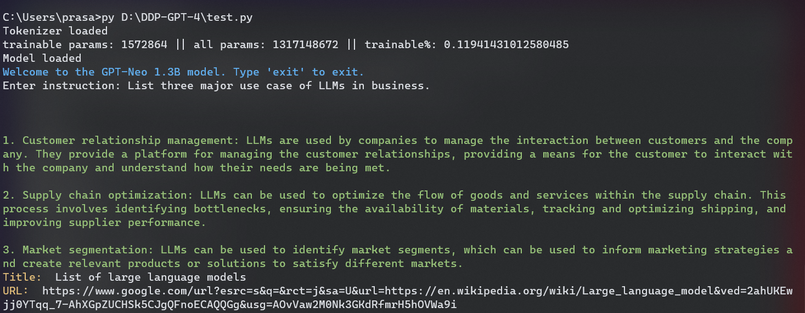

# GPT-NEO-1.3B-Instruct
This is an instruction-tuned model similar to chatGPT-like models but in a smaller size. It has been trained on various datasets from Hugging Face.

## Table of contents
  * [Basic example](#basic-example)
  * [Installation](#installation)
  * [Usage](#usage)
  * [Usable commands](#usable-commands)
  * [Configuration](#configuration)


### Basic example



### Installation
To install all the necessary packages, use the following command:
```
pip install -r requirements.txt 
```
Download the model weights and store in the projrct directory.

```
gdown --id 12o2cSNNTHDByZmkLE-6pqJXWEoylnvZJ 
```

### Usage
This model has two extra features:

* Search suggestions
* Working with an external text file (.txt)

finally run the script using:
```
python deploy.py
```

### Usable Commands

- `EXIT`: Enter this command to exit the conversation.
- `RESET`: Enter this command to reset the conversation.
- `TXT`: Use this command at the beginning of the prompt and then ask a follow-up question. The file.txt is loaded. Example: `TXT summarize this text`.


### Configuration

Try adjusting the `config.yaml` file to change any configuration in model generation.
